<!--使用的语言-搬砖动画 来源于https://github.com/heartyang520/heartyang520/blob/main/Readme.md?plain=1-->

  

  <table>
    <tr>
      <td>
        
      </td>
      <td>
        
      </td>
    </tr>
  </table>

